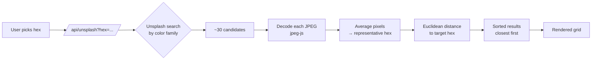

<div align="center">

# La Imagen

**Name a color. Get photographs that match it — sorted by how close their pixels actually are.**

[**→ Open la-imagen.netlify.app**](https://la-imagen.netlify.app)

A color-picker that thinks in pictures. Pick a color from a wheel, a preset, or a hex value, and La Imagen pulls a gallery of Unsplash photos that live in the same world — ranked by pixel distance, not by guesswork.

</div>

---

## What it is

La Imagen is a single-page web app for finding images that match a color in your head. The traditional search box asks for words; La Imagen asks for a color, then ranks results by how close each image's actual RGB pixels are to the target.

```
   pick                search                browse
 ┌────────┐         ┌──────────┐         ┌────────────┐
 │  ◐  │  ──────►  │ Unsplash │  ──────►  │ ranked by  │
 │  hex  │         │  photos  │         │  distance  │
 └────────┘         └──────────┘         └────────────┘
```

It's built as a deliberate design object too: a charcoal darkroom with a live "safelight" aura behind the hero that tracks the color you're currently searching for.

---

## Features

- **Three color inputs.** A canvas-rendered H/S color wheel, a curated preset grid, or direct hex entry. Switch between them inside a focus-trapped modal.
- **Pixel-level ranking.** The server decodes each candidate JPEG with `jpeg-js`, averages the pixels, and sorts results by RGB Euclidean distance to the target.
- **Hex + brightness + page line.** A monospace data line under the hero shows `#FF0000 · v 100% · page 1 of 5 · 142 results` — the room state at a glance.
- **Paginated infinite-style grid.** 30 results per page, replace-on-page-change, cached for 10 minutes per `(hex, page)` tuple.
- **Randomize.** One keystroke, a new color, a new search.
- **The safelight.** A radial gradient behind the hero reads `--chosen` off `<body>` — the room changes color with you.

---

## Tech Stack

| Layer | Choice |
|---|---|
| **Frontend** | React 18 · React Router 6 · TypeScript · Vite 7 |
| **Styling** | TailwindCSS 3 · Radix UI primitives · custom CSS variables |
| **Canvas / Math** | Native `<canvas>` for the H/S wheel · custom HSV/RGB math |
| **Backend** | Express 5 · Vite SSR build · `serverless-http` adapter |
| **Image analysis** | `jpeg-js` for in-process pixel decoding |
| **Validation** | Zod |
| **Deployment** | Netlify Functions (ESM) · `dist/server/production.mjs` prebuilt and re-exported as the function handler |
| **Tooling** | pnpm · TypeScript · Vitest · Prettier |

---

## How it works

The ranking step is the part worth explaining — it's what separates this from "Unsplash with a color filter":



1. The client sends `GET /api/unsplash?hex=FF0000&page=1`.
2. The server maps the hex to a coarse Unsplash color bucket and fetches ~30 candidate photos.
3. Each candidate is decoded in-process with `jpeg-js`, and the average pixel value becomes the photo's "true" color.
4. The server sorts candidates by RGB Euclidean distance to the target hex and returns the ranked list.
5. The client renders the grid; pagination re-uses the in-memory cache for 10 minutes.

A prebuilt server bundle (`dist/server/production.mjs`) is what Netlify's function runtime loads — Express is inlined into that bundle, so the function is self-contained at cold start.

---

## Live demo

**[la-imagen.netlify.app](https://la-imagen.netlify.app)**

The app runs entirely in the browser; the server is only there for the Unsplash proxy and the pixel analysis.

---

## Local development

```bash
git clone https://github.com/chinglung-angh27/la-imagen.git
cd la-imagen
pnpm install
cp .env.example .env       # then fill in UNSPLASH_ACCESS_KEY
pnpm dev                   # http://localhost:8080
```

The dev server runs the Express API on Vite's middleware, so `/api/*` works without a separate process.

### Environment variables

| Variable | Required | Purpose |
|---|---|---|
| `UNSPLASH_ACCESS_KEY` | **Yes** | Unsplash API key. Get one at [unsplash.com/developers](https://unsplash.com/developers). The `/api/unsplash` route returns a 500 until this is set. |
| `VITE_PUBLIC_BUILDER_KEY` | No | Reserved for the optional Builder.io integration. |
| `PING_MESSAGE` | No | Custom string for the `GET /api/ping` health check. |

On Netlify, set `UNSPLASH_ACCESS_KEY` under **Site settings → Environment variables** — the function runtime does not read your local `.env`.

### Scripts

| Command | What it does |
|---|---|
| `pnpm dev` | Vite dev server with Express middleware |
| `pnpm build` | Build client (`dist/spa`) + server (`dist/server/production.mjs`) |
| `pnpm typecheck` | `tsc` with no emit |
| `pnpm test` | Vitest single run |
| `pnpm format.fix` | Prettier write |

---

## Project structure

```
.
├── client/                 # React SPA
│   ├── pages/Index.tsx     # The color picker + image grid (one file, ~730 lines)
│   ├── components/ui/      # Radix-based UI primitives
│   ├── lib/color.ts        # HSV/RGB math, hex parsing, color distance
│   └── global.css          # TailwindCSS 3 + design tokens (the safelight)
├── server/                 # Express API
│   ├── index.ts            # createServer() + serverless handler export
│   ├── production.ts       # Function entry — re-exports handler
│   ├── routes/unsplash.ts  # The /api/unsplash route (search + pixel ranking)
│   └── node-build.ts       # Dev-only HTTP runner
├── shared/api.ts           # Shared types between client and server
├── netlify/
│   └── functions/api.js    # One-line re-export of dist/server/production.mjs
├── netlify.toml            # Build, functions, redirects, external_node_modules
├── vite.config.ts          # Client build
└── vite.config.server.ts   # SSR build (the prebuilt server bundle)
```

---

## Design notes

A small studio's identity for an image-search tool. Intended to feel closer to a darkroom than a SaaS dashboard.

- **Type system.** *Instrument Serif* (display, italic — also serves as the wordmark), *Switzer* (body), *Space Mono* (the data line under the hero).
- **Palette.** Charcoal `#16161A` darkroom. A single live accent: a fixed radial gradient behind the hero that reads `--chosen` off `<body>`. The room lights up in the color you're searching for.
- **The safelight is the signature.** Everything else — inputs, grid, type — is held quiet so that one element can carry the page. No second decoration competing with it.

---

## License

[MIT](./LICENSE).
